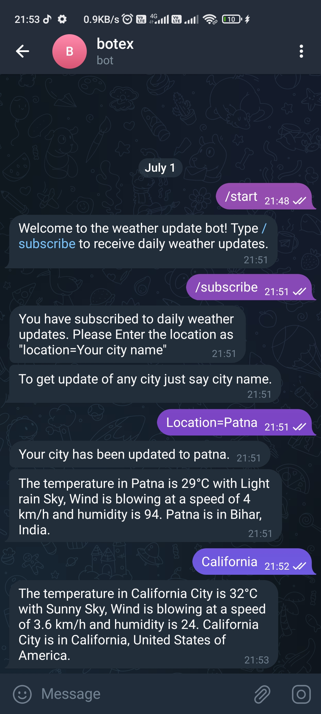
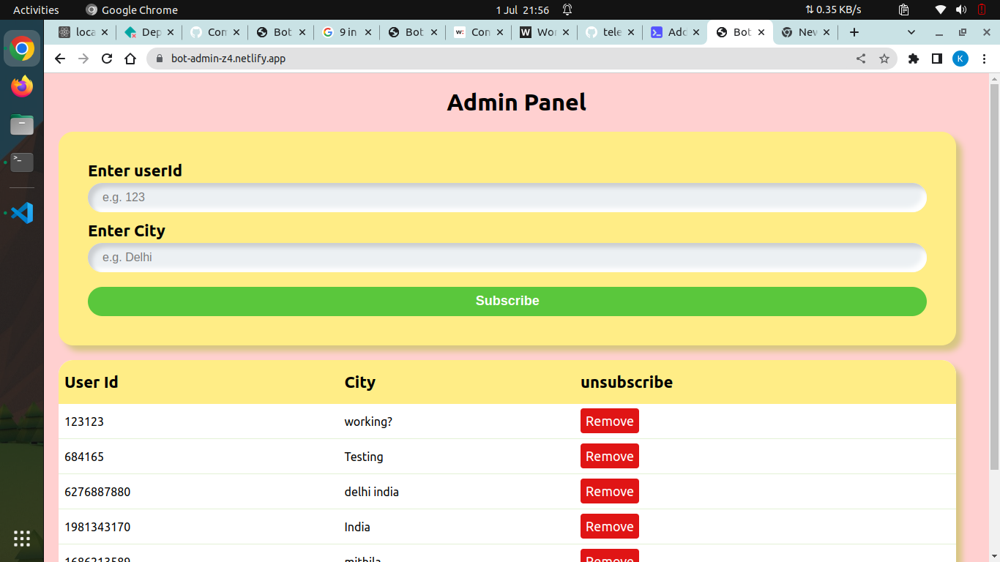
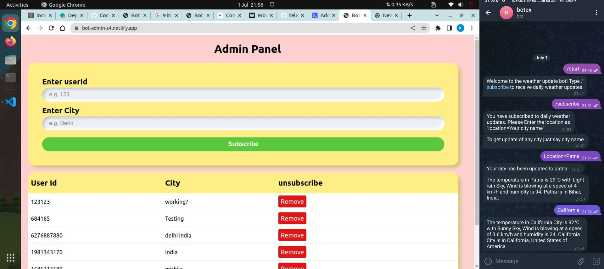

<!-- 
 -->


## Have a Look: [Bot-admin](https://bot-admin-z4.netlify.app/) 

# Admin Page for Telegram Weather Update Bot

This project is the frontend admin page for the Telegram Weather Update Bot. It provides an interface for administrators to manage settings and perform administrative tasks for the bot. You can use this by searching keshavcodexbot, the name of this bot is botex.

# Here is the [Telegram Bot](https://github.com/keshavcodex/telegram-bot)

## Features

- Login functionality for administrators.
- Dashboard to view bot statistics and important information.
- Settings page to configure bot settings.
- User management page to manage user accounts.
- Logs page to view and analyze bot activity logs.

## Prerequisites

- Node.js installed on your machine.

## Installation

1. Clone the repository:

```shell
git clone https://github.com/keshavcodex/bot-admin
```

2. Navigate to the project directory:

```shell
cd admin-page
```

3. Install the dependencies:

```shell
npm install
```

## Usage

1. Start the development server:

```shell
npm start
```

2. Open your web browser and navigate to `http://localhost:3000`.

3. Login using your administrator credentials.

4. Explore the different pages of the admin panel to manage bot settings, user accounts, view statistics, and access logs.

## Contributing

Contributions are welcome! If you have any suggestions or improvements for this project, feel free to open an issue or submit a pull request.

## License

This project is licensed under the [MIT License](https://opensource.org/licenses/MIT).

## Acknowledgments

- This project was inspired by the need for an admin interface to manage the Telegram Weather Update Bot.
- Special thanks to the developers and contributors of the frontend frameworks and libraries used in this project.

## Contact

For any inquiries or questions, please contact [Keshav Kumar](mailto:keshavcodex@gmail.com).
